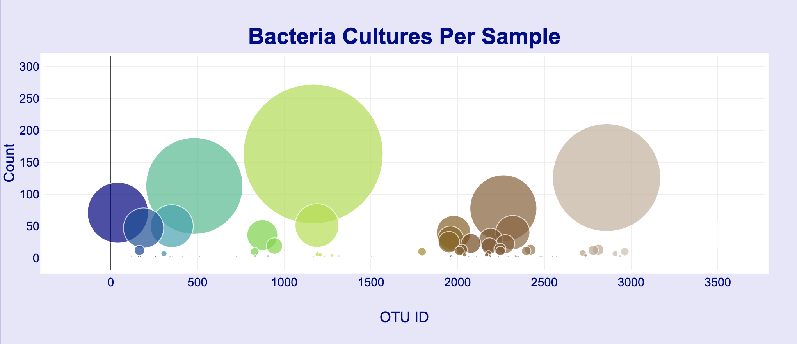
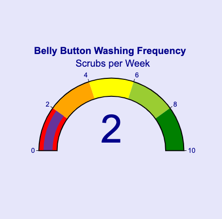

# Belly_button_biodiversity

Belly button Analysis with D3.json

*_Website can be accessed at:https://krishnakalisarkar.github.io/Belly_button_biodiversity/_*

## Overview of Analysis:

"*Improbable Beef*" Beef from Belly Button bacteria !!! Sounds Impossible !!!  
Well, nothing is impossible in Biological Sciences. The purpose of this research group is to discover bacterial species in the belly button that synthesize protein that tastes like beef. There are a number of enthusiastic volunteers who donated their belly button bacteria for testing in the research laboratory.

### Purpose of this study:

The purpose of this study is to create a website with full information where the volunteers of this study will be able to identify the top 10 bacterial species present in their belly buttons. That way, if "*Improbable Beef*" identifies a species of bacteria as a candidate to manufacture synthetic beef, the volunteers will be able to identify whether that species is found in their navel.  
The process of website building was initiated by making a dashboard and panel for demographic information where a volunteer's Id can be used as an "input". This was followed by creating visualization of the top 10 bacterial data for each volunteer.

### Horizontal Bar graph:

A horizontal bar graph with hover text was created with the top 10 bacterial data along with their OTU ID's.

### Bubble graph:

A bubble graph with hover text was created including all the bacterial species that are present in the volunteer's belly button.

### Gauge map:

A Gauge Chart is created with taking the washing frequency from the metadata where the bar of the gauge marks the number of washing frequencies.

### Results:

A website was successfully created with a dashboard and visualization of all the graphs and charts.
